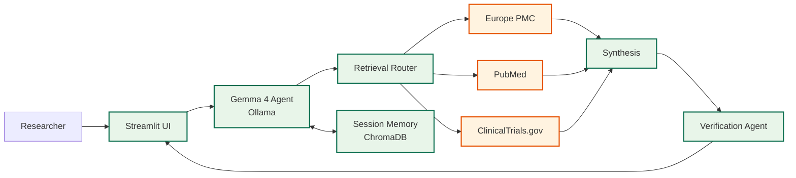

# Drug Target Literature Agent

A locally-deployed clinical research assistant that uses Gemma 4 (via Ollama) to search biomedical literature and synthesize cited summaries — without any query or response leaving the researcher's machine.


---

## The problem this solves

When a computational biologist wants to explore a novel drug target — say, an unpatented kinase involved in a resistance pathway — the fastest way to survey the literature is to ask an LLM. But the moment they type that target name into ChatGPT, Claude, or Gemini, the query leaves their network. For pre-IND research, competitive intelligence, or any work touching unpublished IP, that's a real problem. Legal and InfoSec teams have started blocking these tools outright, which leaves researchers back to manual Boolean searches in PubMed.

This project is a working answer to that constraint: all reasoning happens on the local machine. The only data that crosses the network boundary is an anonymized search term hitting a public biomedical API — the same request PubMed has been receiving from researchers' browsers for twenty years.

It started as a Kaggle competition entry (hence the Gemma 4 requirement) and has since been extended into a reference implementation for what I've been calling "IP-safe agentic retrieval" — a pattern I think applies well beyond this specific use case. The architecture is model-agnostic: swap the model name in config and everything else adapts.

## What it does

Ask a natural-language question about a drug-target interaction. The agent decides which literature sources to query, fetches results, synthesizes an answer, and verifies its own citations before returning. Example queries it handles well:

- *What are the mechanisms of acquired resistance to Osimertinib in EGFR-mutant NSCLC?*
- *Find recent evidence on PARP inhibitor resistance in BRCA-mutated ovarian cancers.*
- *Summarize clinical evidence for combining CDK4/6 inhibitors with aromatase inhibitors in HR+ breast cancer.*

## Screenshots

*Screenshots of the running app and evaluation dashboard: see [docs/screenshots/](docs/screenshots/)*

## Architecture

Five layers, all running locally except for the retrieval API calls:



Green boxes run locally. Orange boxes are public APIs that receive only the search query text — no user identity, no session context, no prior queries.

Full architecture details are in [docs/ARCHITECTURE.md](docs/ARCHITECTURE.md).

## Features

- **Local inference via Ollama.** Default model is Gemma 4; swap to any Ollama-supported model by setting the `OLLAMA_MODEL` environment variable. No cloud LLM calls, ever.
- **Multi-source retrieval** across Europe PMC, PubMed, and ClinicalTrials.gov. The agent decides which sources to hit based on the question.
- **Citation verification agent** runs a second pass on every synthesized response, checking each claim against the source it cites. Responses show a confidence badge based on the fraction of claims that verified.
- **Session memory** via a local ChromaDB instance. Follow-up questions can reference prior findings without re-querying.
- **Evaluation harness** with a 25-question benchmark across five categories (mechanism, resistance, clinical evidence, safety, emerging targets). Measures retrieval precision, citation accuracy, factual coverage, and hallucination rate.

## Quick start

**Prerequisites:**
- Python 3.10+
- Ollama running locally
- A model pulled (Gemma 4 by default):
  ```bash
  ollama pull gemma4:e4b
  ```

**Install and run:**

```bash
git clone https://github.com/vmadhuvarshi/Drug_Target_Literature_Agent.git
cd Drug_Target_Literature_Agent
pip install -r requirements.txt
streamlit run app.py
```

**To use a different model or remote Ollama instance:**

```bash
export OLLAMA_MODEL=llama3.1:8b
export OLLAMA_HOST=http://your-gpu-server:11434
streamlit run app.py
```

**To run the evaluation benchmark:**

```bash
python -m eval.benchmark
python -m eval.benchmark --category "Drug resistance" --limit 5
```

Results are written to `eval/results/` as JSON, CSV, and a summary markdown report with radar chart.

## Repository structure

| Path | Purpose |
|---|---|
| `app.py` | Streamlit UI and main agent loop |
| `retrieval_router.py` | Routes queries to one or more literature sources |
| `sources/` | Per-source retrieval modules (Europe PMC, PubMed, ClinicalTrials.gov) |
| `verification_agent.py` | Second-pass citation verification |
| `session_memory.py` / `session_manager.py` | ChromaDB-backed research session state |
| `models/` | Pydantic schemas for claims, citations, and verification results |
| `eval/` | Benchmark questions, metrics, and evaluation runner |
| `docs/` | Architecture documentation and Mermaid diagrams |
| `pages/` | Streamlit multi-page app (Evaluations dashboard) |

## Documentation

- [**Architecture**](docs/ARCHITECTURE.md) — layers, data flow, security boundary, trade-offs
- [**Pattern Guide**](docs/PATTERN_GUIDE.md) — how to adapt this pattern for pharmacovigilance, regulatory document search, or competitive intelligence
- [**Evaluation Methodology**](docs/EVAL_METHODOLOGY.md) — benchmark design and metric definitions

## Honest limitations

Worth saying out loud, since anyone evaluating this seriously will ask:

- **Gemma 4 (4B) is a small local model.** Synthesis quality is noticeably below GPT-4-class models. For production pharma use, you'd want to run a larger model (Llama 3.3 70B, Gemma 27B, or similar) on appropriate hardware. The architecture is model-agnostic — swap via environment variable.
- **"Zero leakage" refers to LLM traffic, not search traffic.** The search terms themselves go to public APIs. For truly sensitive queries, you'd want to add query obfuscation or route through an internal literature mirror.
- **No enterprise features.** No auth, audit logging, multi-tenancy, or access controls. This is a reference implementation, not a deployable product.
- **The verification agent is a helpful check, not a guarantee.** It catches obvious hallucinations but can miss subtle misattributions. Treat confidence scores as directional.

## Background

I built this while exploring what privacy-first agentic architectures look like in regulated industries. The original Kaggle submission was a single-source prototype using Gemma 4; the current version extends it into a reference pattern I think applies to a lot of pharma/biotech use cases where cloud LLMs are a non-starter.

The architecture is model-agnostic by design. While Gemma 4 is the default (and was the Kaggle requirement), the system works with any model Ollama supports — just change the environment variable.

Feedback, forks, and adaptations welcome.

## License

MIT
